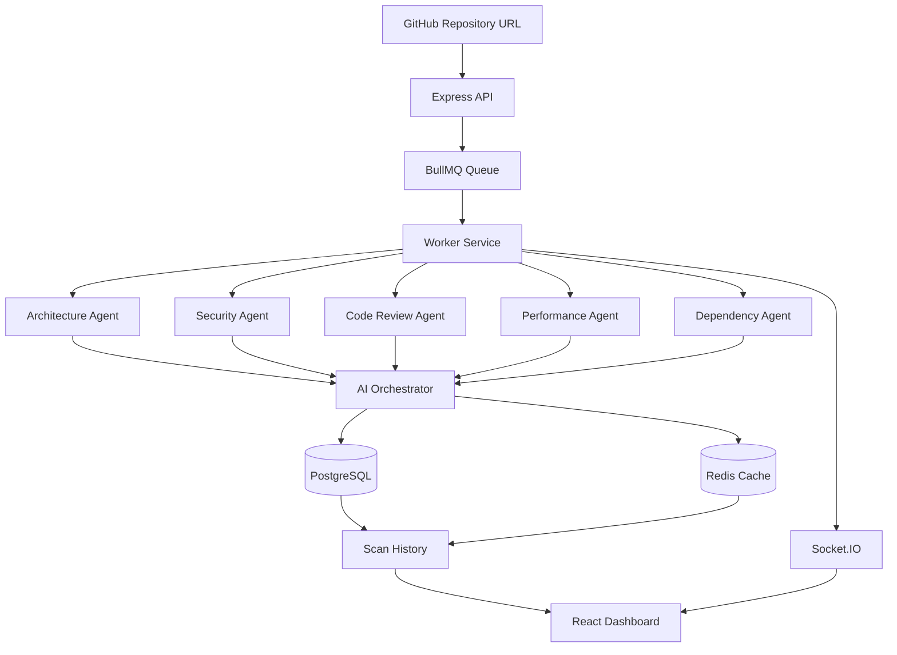

# AI Software Engineering Team

AI-powered multi-agent repository analysis platform that performs architecture review, security auditing, code quality analysis, dependency inspection, and performance evaluation for GitHub repositories.

## Features

* Repository scanning from GitHub URL
* Multi-agent AI analysis system
* Architecture review
* Security vulnerability detection
* Code quality assessment
* Dependency analysis
* Performance analysis
* AI Orchestrator for executive summaries
* Real-time scan progress using Socket.IO
* Background job processing with BullMQ
* Redis caching for faster repeated scans
* PDF report generation
* Scan history and dashboard

## Architecture

## Architecture



## Tech Stack

### Frontend

* React
* React Router
* Zustand
* Axios
* Vite

### Backend

* Node.js
* Express.js
* BullMQ
* Redis
* Prisma ORM
* PostgreSQL
* Socket.IO

### AI Layer

* GPT-4o Mini
* Multi-Agent Architecture
* Repository Intelligence Engine

## Workflow

1. User submits a GitHub repository URL.
2. Repository structure is extracted.
3. BullMQ creates a scan job.
4. Worker processes the repository.
5. Five AI agents analyze the codebase in parallel.
6. Orchestrator combines findings.
7. Results are stored in PostgreSQL.
8. Reports are cached in Redis.
9. Real-time progress is sent to the frontend.

## Key Engineering Features

* Parallel AI Agent Execution
* Queue-Based Processing
* Redis Caching Layer
* Real-Time Progress Tracking
* Repository Metadata Extraction
* AI-Generated Executive Reports
* Failure Recovery & Error Handling

## Environment Variables

Backend:

```env
DATABASE_URL=
GITHUB_TOKEN=
UPSTASH_REDIS_URL=
UPSTASH_REDIS_TOKEN=

REDIS_HOST=
REDIS_PORT=
REDIS_USERNAME=
REDIS_PASSWORD=
```

## Installation

### Backend

```bash
cd backend
npm install
npm run dev
```

### Frontend

```bash
cd frontend
npm install
npm run dev
```

## Future Enhancements

* Pull Request Analysis
* Team Collaboration Dashboard
* Repository Comparison
* CI/CD Integration
* Custom Rule Engine
* Multi-Language Support

## Author

Ankit Tripathi
Full Stack Developer
